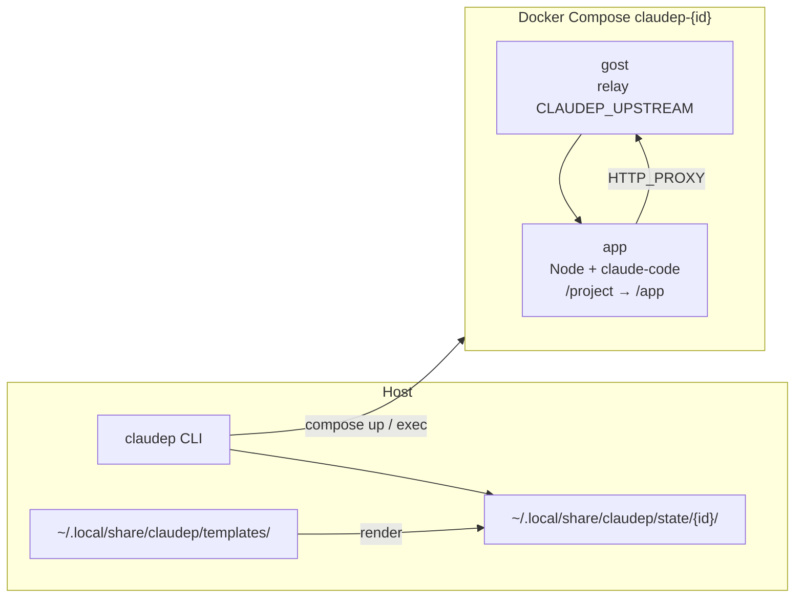

# claudep

**claudep** (*claude* + *p*roxy) — CLI для [Claude Code](https://docs.anthropic.com/en/docs/claude-code) в изолированном Docker-стеке с relay (gost) до вашего upstream-прокси, когда API недоступен напрямую из региона.

Обычная команда **`claude`** запускает CLI на хосте. **`claudep`** поднимает per-project стек (gost + app), монтирует текущий каталог в контейнер и направляет трафик через relay — без `docker-compose.yml` в git.

Работает из **корня любого проекта** в терминале.

> Неофициальный инструмент, не связан с Anthropic.

**Статус:** проектирование и установщик; реализация CLI — в работе.

---

## Зачем

| Проблема | Решение claudep |
|----------|-----------------|
| `claude` на хосте не ходит в API без VPN/прокси | Relay в контейнере **gost** → ваш `CLAUDEP_UPSTREAM` |
| Не хочется класть `docker-compose.yml` в репозиторий | Артефакты только в `~/.local/share/claudep/state/` |
| Несколько проектов параллельно | Один `project_id` на каталог → отдельный compose-проект |
| Повторный заход в тот же проект | Идемпотентный `claudep` + быстрый `claudep attach` |

---

## Быстрый старт

### Установка (один раз)

```bash
curl -fsSL https://raw.githubusercontent.com/<org>/claudep/main/install.sh | sh
```

Установщик:

1. Кладёт бинарь **`claudep`** в `~/.local/bin` (или путь из `$CLAUDEP_INSTALL_DIR`).
2. Скачивает **шаблоны Docker** в `~/.local/share/claudep/templates/` (compose, Dockerfile, gost).
3. Дописывает в shell-профиль (`~/.zshrc`, `~/.bashrc`) (во время установки надо спросить значение и предложить дефолт!):

   ```bash
   export CLAUDEP_HOME="${CLAUDEP_HOME:-$HOME/.local/share/claudep}"
   export CLAUDEP_TEMPLATES="$CLAUDEP_HOME/templates"
   # Upstream для gost (SOCKS5/HTTP на хосте). Обязателен в «закрытых» регионах.
   export CLAUDEP_UPSTREAM="${CLAUDEP_UPSTREAM:-socks5://127.0.0.1:1080}"
   ```

4. Проверяет наличие `docker` и `docker compose` (предупреждение, если нет).

Перезагрузите shell или `source ~/.zshrc`.

### В каталоге проекта

```bash
cd ~/Developer/my-app

# Поднять стек для cwd, если ещё не запущен (gost + app)
claudep

# Интерактивный shell / claude внутри контейнера
claudep attach
```

Первый **`claudep`** для этой папки: генерирует compose в state, собирает образ, стартует контейнеры.  
Повторный **`claudep`** для той же папки: no-op или `compose up -d`, если стек уже есть.

---

## Команды

| Команда | Назначение |
|---------|------------|
| **`claudep`** | Убедиться, что стек для **текущего** `cwd` запущен (идемпотентно) |
| `claudep attach` | `docker compose exec` → shell (или `claude`) в app-контейнере |
| `claudep down` | Остановить стек этого проекта |
| `claudep status` | Контейнеры / health gost / путь к state |
| `claudep doctor` | Docker, переменные, доступность upstream |
| `claudep sync` | Обновить шаблоны с релиза |

---

## Как это устроено

### Принципы

1. **Изоляция по проекту** — несколько проектов = несколько compose.
2. **Репозиторий пользователя не меняется** — только `~/.local/share/claudep/state/<project_id>/`.
3. **Идемпотентность** — **`claudep`** без субкоманды безопасно вызывать многократно.

### Идентификация проекта

```
project_root    = абсолютный путь к cwd (или --project-dir)
project_id      = стабильный slug, например sha256(project_root)[:12]
compose_project = "claudep-" + project_id
state_dir       = $CLAUDEP_HOME/state/<project_id>/
```

В `state_dir` лежат сгенерированные `docker-compose.yml`, контекст сборки, служебные volume-метаданные — **не** в git.

### Стек Docker (на проект)



| Сервис | Роль |
|--------|------|
| **gost** | Relay: локальный HTTP/SOCKS в стеке  |
| **app** | Node slim + `@anthropic-ai/claude-code`, mount `project_root` → `/app` |

Переменные в app-контейнере: `HTTP_PROXY`, `HTTPS_PROXY`, `ALL_PROXY` → gost; `NO_PROXY=localhost,127.0.0.1`.

---

## Конфигурация

### Переменные окружения

| Переменная | По умолчанию | Описание |
|------------|--------------|----------|
| `CLAUDEP_HOME` | `~/.local/share/claudep` | Корень данных и state |
| `CLAUDEP_TEMPLATES` | `$CLAUDEP_HOME/templates` | Шаблоны compose/Dockerfile |
| `CLAUDEP_UPSTREAM` | *(нет)* | Upstream на хосте для gost (`socks5://…`, `http://…`) |
| `CLAUDEP_INSTALL_DIR` | `~/.local/bin` | Куда положить `claudep` при install |
| `CLAUDEP_NODE_IMAGE` | `node:22-slim` | Базовый образ app-сервиса |

---

## Установщик `install.sh`

Поведение (целевое):

```
install.sh
├── detect OS/arch (darwin/linux, arm64/amd64)
├── install claudep binary → $CLAUDEP_INSTALL_DIR
├── fetch templates tarball → $CLAUDEP_TEMPLATES
├── write/update shell snippet (idempotent grep CLAUDEP_HOME)
└── claudep doctor (soft check)
```

---

## Требования

- **Docker** Engine или Docker Desktop
- **`docker compose`** v2
- Доступный **upstream** (`CLAUDEP_UPSTREAM`) с хоста, куда gost сможет подключиться
- macOS или Linux (Windows — через WSL2 + Docker внутри WSL)

---

## Лицензия

MIT — см. [LICENSE](LICENSE).
